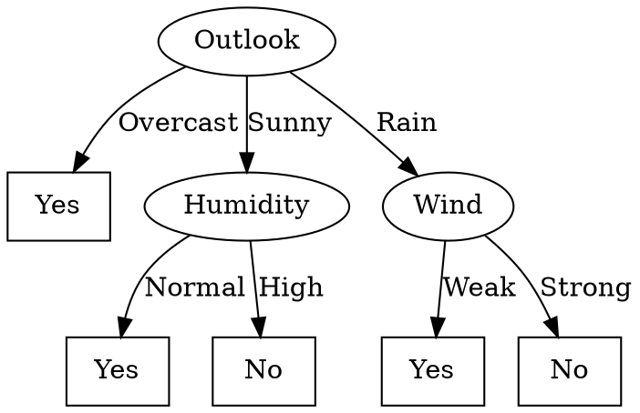

# Decision tree

## Introduzione

Gli alberi decisionali sono un metodo d'apprendimento per approssimare funzioni a valori discreti.
Vengono impiegati per la risoluzione di problemi aventi le seguenti caratteristiche (a grandi linee):
* Le istanze sono rappresentate da coppie *attributo-valore*, descritte dunque da un insieme finito di attributi e i loro rispettivi, disgiunti e finiti, valori (ad esempio l'attributo *Temperatura* che può assumere valori in {*Calda, Fredda, Mite*})
* La funzione target è a valori discreti (estendibile a funzioni a valori reali)
* La funzione da apprendere può essere descritta da disgiunzioni
* Il training set può contenere errori
* Il training set può contenere attributi con valore mancante

## Rappresentazione

Ogni **nodo** rappresenta il test di un qualche attributo dell'istanza e ogni **ramo** che parte da tale nodo corrisponde ad uno dei possibili valori che l'attributo in questione può assumere. Le **foglie** rappresentano l'output della funzione target (la classificazione, dunque).
Un'istanza è classificata partendo dalla root dell'albero, testando l'attributo specificato dal nodo e muovendosi seguendo il ramo dell'albero che corrisponde al valore assunto dall'attributo in quell'esempio fino al raggiungimento di una foglia.
In generale un albero decisionale rappresenta **disgiunzioni di congiunzioni** di vincoli sui valori degli attributi delle istanze.
Ogni cammino dalla root ad una foglia è una congiunzione di test sugli attributi, l'albero è la disgiunzione di tali congiunzioni.

L'albero sopra rappresentato codifica la seguente funzione booleana:
$(Outlook = Sunny \land Humidity = Normal)\lor (Outlook = Overcast) \lor (Outlook = Rain \land Wind = Weak)$