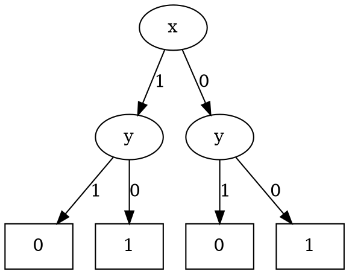
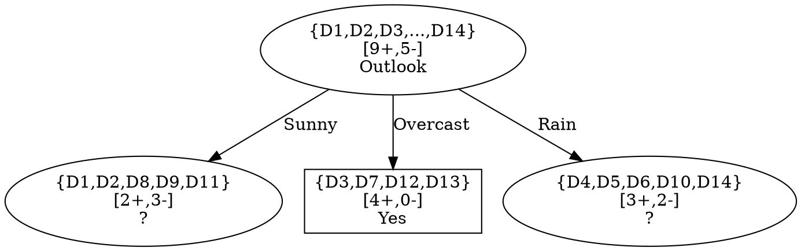

# Decision tree

## Introduzione

Gli alberi decisionali sono un metodo d'apprendimento per approssimare funzioni a valori discreti, .
Vengono impiegati per la risoluzione di problemi aventi le seguenti caratteristiche (a grandi linee):

* Le istanze sono rappresentate da coppie *attributo-valore*, descritte dunque da un insieme finito di attributi e i loro rispettivi, disgiunti e finiti, valori (ad esempio l'attributo *Temperatura* che può assumere valori in {*Calda, Fredda, Mite*})
* La funzione target è a valori discreti (estendibile a funzioni a valori reali)
* La funzione da apprendere può essere descritta da disgiunzioni
* Il training set può contenere errori
* Il training set può contenere attributi con valore mancante

## Rappresentazione

Ogni **nodo** rappresenta il test di un qualche attributo dell'istanza e ogni **ramo** che parte da tale nodo corrisponde ad uno dei possibili valori che l'attributo in questione può assumere. Le **foglie** rappresentano l'output della funzione target (la classificazione, dunque).
Un'istanza è classificata partendo dalla root dell'albero, testando l'attributo specificato dal nodo e muovendosi seguendo il ramo dell'albero che corrisponde al valore assunto dall'attributo in quell'esempio fino al raggiungimento di una foglia.
In generale un albero decisionale rappresenta **disgiunzioni di congiunzioni** di vincoli sui valori degli attributi delle istanze.
Ogni cammino dalla root ad una foglia è una congiunzione di test sugli attributi, l'albero è la disgiunzione di tali congiunzioni.

L'albero sopra rappresentato codifica la seguente funzione booleana:
$(Outlook = Sunny \land Humidity = Normal)\lor (Outlook = Overcast) \lor (Outlook = Rain \land Wind = Weak)$

### Esempio

Ad esempio data la segeunte tabella di verità
x | y | z
:--:|:--:|:--:
1|1|0
0|1|1
1|0|0
0|0|1

l'albero decisionale associato ad essa è

>**NOTA BENE** 
Gli alberi decisionali possono esprimere una qualsiasi formula boolena $\phi$ in [prima forma canonica](https://en.wikipedia.org/wiki/Canonical_normal_form) (somma di mintermini)

@import "../images/albdec-canonical.png" 

## ID3

L'algoritmo di decisione ID3 è un algoritmo **greedy** che costruisce l'albero decisionale in maniera **top-down**, partendo con la seguente domanda: *quale attributo dev'essere testato nella root dell'albero*?
Per rispondere a questa domanda ogni attributo viene valutato mediante un test statistico per determinare quanto bene, da solo, classifica (o partiziona) gli esempi di training, viene selezionato **il migliore attributo** e vengono poi creati tanti discendenti della root quanti sono i valori che tale attributo può assumere. Il processo viene reiterato per ogni discendente della root fino a che l'albero classifica alla perfezione gli esempi di training o non ci sono più attributi da testare.
L'algoritmo è dunque il seguente:

@import "../images/id3.png"

### Entropia

Il test statistico per determinare quale sia il migliore attributo si basa sul concetto di [entropia](https://en.wikipedia.org/wiki/Entropy_(information_theory)):
> Dato un'insieme $S$, contenente esempi positivi e negativi di un qualche target concept, l'**entropia** di $S$ è definita come: $$ E(S)=\sum_{i=1}^{c}-p_ilog_2(p_i) $$ dove $c$ è il numero totale di classi e $p_i$ è la probabilità che un elemento di $S$ appartenga alla classe $i$.
> Notare che:
>* $E(S)=0$ se tutti gli elementi di $S$ appartengono ad una stessa classe
>* $E(S)=1$ se tutte le $c$ classi sono ben bilanciate, ovvero contengono lo stesso numero di esempi

In generale, nell'Information Theory l'entropia rappresenta il **contenuto informativo** associato ad un certo evento: più un evento è raro più informazione otteniamo quando tale evento si verifica.

#### Esempio

Supponiamo $S$ sia un insieme di 14 esempi di un qualche target concept booleano contenente 9 esempi positivi e 5 esempi negativi ($[9+, 5-]$ per semplicità di notazione), allora l'entropia di $S$ sarà:
$$E(S=[9+,5-])=-\frac{9}{14}log_2(\frac{9}{14})-\frac{5}{14}log_2(\frac{5}{14})=0.94$$

### Information gain

Data l'entropia, possiamo ora definire una misura per stabilire quale sia l'attributo che meglio partiziona gli esempi di training:
> L'**information gain** di un attributo $A$ relativo ad un insieme di esempi $S$ è definito come $$ Gain(S,A) \equiv E(S) - \sum_{v \in Values(A)} \frac{|S_v|}{|S|}E(S_v) $$ dove:
> * $Values(A)$ è l'insieme dei possibili valori dell'attributo $A$
> * $S_v=\{s \in S\ |\ A(s)=v\}$, ovvero è il sottoinsieme di $S$ per cui l'attributo $A$ assume valore $v$

$Gain(S,A)$ è dunque dato dall'entropia $E(S)$ dell'intero insieme di esempi $S$ meno l'entropia ottenuta partizionando $S$ utilizzando l'attributo $A$; determina quindi di quanto si riduce l'entropia di $S$ conoscendo il valore assunto dall'attributo $A$

### Esempio

Supponiamo di avere il seguente training set $S$:

@import "../images/id3-example.png"

e supponiamo che il target concepot da inferire sia PlayTennis.
Come primo passo ID3 determina l'attributo da associare alla root calcolando il $Gain(S,A)$ per ogni attributo $A$, ovvero:

* $Gain(S, Outlook)=E(S)-\sum_{v \in Values(Outlook)} \frac{|S_v|}{|S|}E(S_v)=E(S)-\frac{5}{14}E(S_{Sunny})-\frac{4}{14}E(S_{Overcast})-\frac{5}{14}E(S_{Rain})=E([9+,5-])-\frac{5}{14}E([2+,3-])-\frac{4}{14}E([4+,0-])-\frac{5}{14}E([3+,2-])=0.94-0.35-0-0.35=0.24$
* $Gain(S, Wind) = E(S)-\sum_{v \in Values(Wind)} \frac{|S_v|}{|S|}E(S_v)=E(S)-\frac{6}{14}E(S_{Strong})-\frac{8}{14}E(S_{Weak})=0.94-0.43-0.46=0.05$
* $Gain(S,Temperature)=0.03$
* $Gain(S,Humidity)=0.15$

Graficamente la situazione è la seguente:

