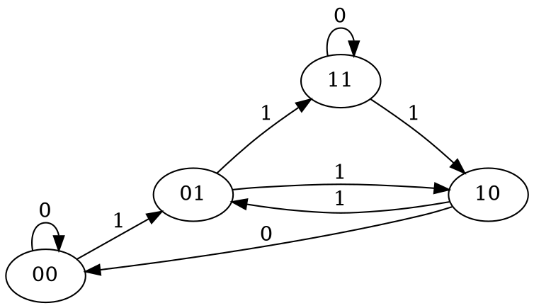

# Sistemi complessi

## Introduzione

Un automa cellulare (AC d'ora in avanti) è un sistema dinamico discreto costituito da una rete regolare di automi a stati finiti (celle), che cambiano i loro stati sulla base dei loro vicini applicando una regola d'aggiornamento locale. Tutte le celle cambiano il loro stato simultaneamente, utilizzando la stessa regola locale; questo processo viene ripetuto iterativamente nel tempo, dove gli istanti di tempo assumono valori discreti.
Dunque, gli AC sono:

* **Discreti** nello spazio e nel tempo
* **Omogenei/Uniformi** nello spazio e nel tempo, in quanto gli stati vengono aggiornati, per ogni istante di tempo, applicando la stessa regola locale a tutte le celle
* **Locali** nelle loro interazioni, in quanto l'aggiornamento di una cella dipende solo ed esclusivamente dai suoi vicini

I motivi principali dell'utilizzo di AC derivano principalmente dal fatto che molti processi in natura sono governati da regole locali ed omogenee, come ad esempio la fluido dinamica (interazione tra particelle in un reticolo regolare, dove la regola locale simula la collisione tra di esse), dunque modellabili utilizzando AC; inoltre essi risultano essere modelli matematici di calcolo parallelo: le semplici regole locali d'aggiornamento li rende computazionalmente universali ([Game of Life](https://en.wikipedia.org/wiki/Conway%27s_Game_of_Life)).

## Automi cellulari

Siano $A, B$ due insiemi, indichiamo con $B^A$ l'insieme di tutte le funzioni dall'insieme $A$ nell'insieme $B$, ovvero $B^A=\{f|f:A \rightarrow B\}$, la cui cardinalità si ricorda essere $|B^A|=|B|^{|A|}$, poiché ogni $a \in A$ posso mapparlo in uno dei $|B|$ elementi di $B$, dunque avrei $|B|\cdot|B|\cdot|B|\cdot...\cdot|B|$, $|A|$ volte.
Essendo gli AC discreti nello spazio e nel tempo, le funzioni che andremo a considerare saranno del tipo $A^{\mathbb{Z}^k} = \{f|f:\mathbb{Z}^k \rightarrow A,\ k \in \mathbb{N},\ k \ge 1\}$, dove $A$ è un insieme finito di simboli, rappresentanti i possibili **stati** dell'AC; dunque un elemento $x \in A^{\mathbb{Z}^k}$, che assegna ad ogni "posizione" di $\mathbb{Z}^k$ uno stato $a \in A$ è detto **configurazione**. Una configurazione può essere vista come uno *snapshot* di tutti gli stati delle celle del sistema ad un certo tempo $t$.
La nostra trattazione verterà principalmente su AC 1- e 2-dimensionali, ovvero tali per cui $1 \le k \in \mathbb{N} \le 2$: in questi casi una configurazione può essere vista come una stringa bi-infinita $(...\ a_{-i}\ a_{-i+1}\ a_{-i+2}\ ...\ a_{-2}\ a_{-1}\ a_{0}\ a_{1}\ a_{2}\ ...\ a_{i-2}\ a_{i-1}\ a_{i}\ ...)$, dove $a_i \in A$ rappresenta lo stato assunto dalla cella $i$, $\forall i \in \mathbb{Z}$, nel caso 1-dimensionale, o come una matrice bi-infinita nel caso 2-dimensionale.
Definiamo ora il concetto di **distanza** nel caso di AC 1-dimensionali.

> Dati $x,y \in A^{\mathbb{Z}}$ si definisce distanza la funzione $d(x,y):A^{\mathbb{Z}} \times A^{\mathbb{Z}} \rightarrow \mathbb{R}_+$ tale che $$ d(x,y) = \begin{cases} 0\ \ \ \ \ \text{se}\ x = y \\ \frac{1}{2^n}\ \ \ \text{se}\ x \ne y \end{cases} $$ dove $n = \text{min}\{i \in \mathbb{N}|x_i \ne y_i \lor x_{-i} \ne y_{-i}\}$

Si può dimostrare che tale funzione è una [metrica](https://en.wikipedia.org/wiki/Metric_(mathematics)).
Ad esempio, sia A = {0, 1}. Siano $x,y \in A^{\mathbb{Z}}$ tali che:

* $x = (...\ 1_{-3}\ 1_{-2}\ 0_{-1}\ 1_0\ 1_1\ 0_2\ 1_3\ ...)$
* $y = (...\ 0_{-3}\ 1_{-2}\ 0_{-1}\ 1_0\ 1_1\ 0_2\ 1_3\ ...)$

dove al pedice sono rappresentate le posizioni delle celle, allora in questo caso $n = 3$, poiché $i = -3$ è la prima posizione (quella più piccola) in cui le due stringhe bi-infinite differiscono.

Vale inoltre la seguente proposizione:
> $$\forall x,y \in A^{\mathbb{Z}}, \forall n \in \mathbb{N},\ d(x,y) < \frac{1}{2^n} \Longleftrightarrow x_{[-n,\ n]} = y_{[-n,\ n]}$$ dove con $a_{[-n,\ n]} \subset a \in A^{\mathbb{Z}} = (a_{-n}\ a_{-n+1}\ ...\ a_{-2}\ a_{-1}\ a_0\ a_1\ a_2\ ...\ a_{n-1}\ a_n)$ si indica la "finestra" della stringa bi-infinita $a$, di raggio $n$ e centrata nello 0.

Dimostrazione:

* $\Longrightarrow$
  Infatti se nella finestra di raggio $n$ le stringhe $x$ e $y$ fossero diverse, allora esisterebbe un $m \in \mathbb{N}, m < n : x_{-m} \ne y_{-m} \lor x_m \ne y_m$. Sia $\overline{m}$ il più piccolo tra essi, allora $d(x,y) = \frac{1}{2^{\overline{m}}} > \frac{1}{2^n}$, assurdo.
* $\Longleftarrow$
  Infatti $x_{[-n,\ n]} = y_{[-n,\ n]} \Longrightarrow \exists m \in \mathbb{N}, m > n : x_{-m} \ne y_{-m} \lor x_m \ne y_m$. Sia $\overline{m}$ il più piccolo tra essi, allora $d(x,y) = \frac{1}{2^{\overline{m}}} < \frac{1}{2^n}$
  Se tale $m$ non esiste allora $d(x,y) = 0 < \frac{1}{2^n}$.

### Definizione

>Definiamo dunque un **automa cellulare 1-D** come una tripla $\langle A, r, f\rangle$ tale che:
>
>* A è un insieme finito di simboli, rappresentanti i possibili **stati** assumibili dall'AC
>* $r \in \mathbb{N}$ è detto **raggio**
>* $f:A^{2r+1} \rightarrow A$ è detta **regola locale**, che definisce l'aggiornamento di stato locale di una cella sulla base del suo "vicinato"
>
>Dunque il numero massimo di AC differenti è $|A|^{|A^{2r+1}|}$

Una regola locale può essere fornita in forma tabellare (si pensi ad una funzione di transizione di un automa a stati finiti o di una macchina di Turing), ad esempio:

* A = {0, 1}
* r = 1
* $f:A^3 \rightarrow A$ così definita:

    | a | b | c | $f$ |
    |---|---|---|-----|
    | 0 | 0 | 0 | 0 |
    | 0 | 0 | 1 | 0 |
    | 0 | 1 | 0 | 0 |
    | 0 | 1 | 1 | 1 |
    | 1 | 0 | 0 | 1 |
    | 1 | 0 | 1 | 1 |
    | 1 | 1 | 0 | 0 |
    | 1 | 1 | 1 | 1 |

Se $A = \{0, 1, 2, ..., n\} \subset \mathbb{N}$ e $A$ è finito, questa stessa regola locale può essere invece fornita come la conversione in base $|A|$ dell'ultima colonna di tale tabella, con la cifra più significativa in ultima posizione, ammesso che le combinazioni di possibili tuple siano fornite, in ordine, dalla più piccola alla più grande.
Ovvero, data la funzione d'aggiornamento locale $f$, definiamo $n_f = \sum_{i=0}^{|A|^{2r+1}-1}a_i \cdot |A|^i$, con $a_i \in A$ elemento i-esimo della tabella.
In questo caso avremo: $n_f = \sum_{i=0}^{2^3-1}a_i \cdot 2^i = 0 \cdot 2^0 + 0 \cdot 2^1 + 0 \cdot 2^2 + 1 \cdot 2^3 + 1 \cdot 2^4 + 1 \cdot 2^5 + 0 \cdot 2^6 + 1 \cdot 2^7$
Abbiamo detto che un AC evolve nel tempo in maniera uniforme, ovvero, per ogni istante di tempo, la stessa regola locale viene applicata a tutte le celle dell'automa.
Definiamo dunque la **regola globale di un AC 1-D**:

>Dato $\langle A,r,f \rangle$ AC, la **regola globale** è la funzione $F:A^{\mathbb{Z}} \rightarrow A^{\mathbb{Z}}, \forall x \in A^{\mathbb{Z}}, \forall i \in \mathbb{Z}$ 
$$F(x)_i = f(x_{i-r},\ ...\ ,\ x_i,...\ ,\ x_{i+r}) = f(x_{[i-r, i+r]})$$ dove $f(x_{[i-r, i+r]})$ al solito si intende la finestra della stringa $x$, di ampiezza $r$ e centrata in $i$

L'applicazione di $F\ \forall i \in \mathbb{Z}$ è un aggiornamento dello stato di un AC di tipo:

* **Sincrono**
* **Parallelo**, in quanto ottengo il nuovo stato sulla base di quello vecchio, dunque posso applicare la $F$ in parallelo a tutte le celle di una configurazione ad un determinato tempo $t$
* **Locale**, in quanto l'aggiornamento viene effettuato sulla base di un numero finito e fissato di vicini della cella i-esima, ovvero nel *cono* $[i-r,i+r]$
* **Uniforme** perchè viene applicata sempre la stessa regola locale per aggiornare tutte le $i \in \mathbb{Z}$ celle

Definiamo ora una particolare funzione d'interesse, ovvero la funzione **SHIFT** (a sinistra):

>La funzione $\text{SHIFT}:A^{\mathbb{Z}} \rightarrow A^{\mathbb{Z}}$ è tale che $\forall x \in A^{\mathbb{Z}}, \forall i \in \mathbb{Z}, \text{SHIFT}(x)_i = x_{i+1}$

Possiamo dunque dare ora una definizione alternativa di AC, ovvero:

>Un automa cellulare è una funzione $F:A^{\mathbb{Z}} \rightarrow A^{\mathbb{Z}}$ tale che $F$ è **continua** e $\text{SHIFT} \circ F = F \circ \text{SHIFT}$, ovvero si dice che **commuta con lo SHIFT**.
La funzione SHIFT verrà indicata d'ora in avanti con il simbolo $\sigma$

### Teorema di Hedlund

E' naturale chiedersi a questo punto quali condizioni deve soddisfare una funzione $F:A^{\mathbb{Z}} \rightarrow A^{\mathbb{Z}}$ tale da essere la regola globale di un automa cellulare.
Tali condizioni ci vengono fornite dal **teorema di Hedlund**:

>Sia $F:A^{\mathbb{Z}} \rightarrow A^{\mathbb{Z}}$ una qualsiasi funzione. $F$ è la regola globale di un AC $\iff\ F$ è continua $\land$ $F \circ \sigma = \sigma \circ F$

Dimostrazione:

* $\Longrightarrow$  
  Suppongo $F$ sia la regola globale di un AC $\langle A,r,f \rangle$.  
  Voglio dimostrare che $F$ è continua, ovvero $\forall x \in A^{\mathbb{Z}},\ F$ è **continua in x** se $\forall x \in A^{\mathbb{Z}}, \forall \epsilon > 0, \exists \delta > 0:\forall y \in A^{\mathbb{Z}}, d(x,y) < \delta \implies d(f(x), f(y)) < \epsilon$.  
  Scelti arbitrariamente $x \in A^{\mathbb{Z}}, \epsilon > 0$, allora esiste sempre un $n \in \mathbb{N}:\frac{1}{2^n} < \epsilon$.  
  Voglio dimostrare che $d(F(x),F(y)) < \frac{1}{2^n} < \epsilon$, che è come dimostare che $F(x_{[-n,n]})=F(y_{[-n,n]})$.  
  Dalla definizione di regola globale di un AC sappiamo che $F(x_{[-n,n]})$ dipende unicamente da $x_{[-n-r,n+r]}$.  
  Dunque scegliendo $\delta = \frac{1}{2^{n+r}}$, per il teorema della distanza, si avrà che $x_{[-n-r,n+r]}=y_{[-n-r,n+r]} \iff d(x,y) < \delta = \frac{1}{2^{n+r}}$, dunque a maggior ragione vale che $x_{[-n,n]}=y_{[-n,n]}$ e quindi $F(x_{[-n,n]})=F(y_{[-n,n]})$.  
  $F$ è inoltre **uniformemente continua**, in quanto $\delta$ dipende da n e quindi da $\epsilon$, ma non da $x$.  
  Dimostriamo ora che $F$ commuta con lo SHIFT, ovvero che $F \circ \sigma = \sigma \circ F$. Infatti, $\forall x \in A^{\mathbb{Z}}, \forall i \in \mathbb{Z}$:
  * $(F \circ \sigma)(x)_i = F(\sigma(x))_i = f(\sigma(x)_{[-i-r,i+r]}) = f(x_{[-i-r+1,i+r+1]})$
  * $(\sigma \circ F)(x)_i = \sigma(F(x))_i = F(x)_{i+1} = f(x_{[-i-r+1,i+r+1]})$
* $\Longleftarrow$  
  Sia $F:A^{\mathbb{Z}} \rightarrow A^{\mathbb{Z}}$ tale che $F$ è continua e commuta con lo shift.
  Vogliamo dimostrare che esiste un AC tale che $F$ è la sua regola globale.  
  Sapendo che $A^{\mathbb{Z}}$ è un insieme [compatto](https://it.wikipedia.org/wiki/Spazio_compatto) e sapendo che $F$ è continua per ipotesi, allora per il teorema del regalo (ovvero il [teorema di Heine-Cantor](https://it.wikipedia.org/wiki/Teorema_di_Heine-Cantor)), $F$ è uniformemente continua, ovvero: $\forall \epsilon > 0 \exists \delta > 0: \forall x,y \in A^{\mathbb{Z}}, d(x,y) < \delta \implies d(F(x), F(y)) < \epsilon$.  
  Sia dunque $\epsilon = 1$, allora $d(F(x), F(y)) < 1 \iff F(x)_0 = F(y)_0$.  
  Dunque, scelto un qualsiasi $r \in \mathbb{N}: \frac{1}{2^r} < \delta$ vale che $x_{[-r, r]} = y_{[-r, r]} \implies F(x)_0 = F(y)_0$.  
  Definiamo ora $f:A^{2r+1} \rightarrow A | \forall u \in A^{2r+1}, f(u) = F(z)_0$ con $z \in A^{\mathbb{Z}}$ una qualunque stringa bi-infinita tale che $z_{[-r,r]} = u$.  
  Dimostriamo ora che $\forall x \in A^{\mathbb{Z}}, \forall i \in \mathbb{Z}, F(x)_i = f(x_{[-i-r, i+r]})$, ovvero che F è regola globale.

  1. $\forall x \in A^{\mathbb{Z}}, f(x_{[-r, r]}) = F(x)_0$ per  definizione di $f$
  2. Sia $i \ne 0$, allora $F(x)_i = \sigma^i(F(x)_0) = F(\sigma^i(x))_0$ (avendo a priori dimostrato per induzione che $F \circ \sigma^k = \sigma^k \circ F$). Dunque $F(\sigma^i(x))_0 = f(\sigma^i(x_{[-r, r]})) = f(x_{[i-r,i+r]})$

Dal teorema seguono i seguenti **corollari**:

* Se $F:A^{\mathbb{Z}} \rightarrow A^{\mathbb{Z}}$ è la regola globale di un AC, allora $F^k$ è anch'essa la regola globale di un AC. Infatti avremo che $F^k \circ \sigma = F^{k-1} \circ F \circ \sigma = F^{k-1} \circ \sigma \circ F$, e iterando il processo k-1 volte si otterrà $\sigma \circ F \circ\ ...\ \circ F = \sigma \circ F^k$, dunque F commuta con lo shift; inoltre la composizione di funzioni continue è ancora una funzione continua, ergo F è la regola globale di un AC
* Se $F,G:A^{\mathbb{Z}} \rightarrow A^{\mathbb{Z}}$, allora $F \circ G$ è la regola globale di un AC
* Sia F la regola globale di un AC, dunque continua (uniformemente) e che commuta con lo shift, e supponiamo F sia invertibile. Essendo $A^{\mathbb{Z}}$ un insieme compatto, allora anche $F^{-1}$ è continua. Vale inoltre che $F \circ \sigma \circ F^{-1} = \sigma \circ F \circ F^{-1}$, dunque $F^{-1} \circ F \circ \sigma \circ F^{-1} = F^{-1} \circ \sigma \circ F \circ F^{-1} \equiv \text{Id} \circ \sigma \circ F^{-1} = F^{-1} \circ \sigma \circ \text{Id}$

Diamo ora la seguente definizione:
>$x \in A^{\mathbb{Z}}$ è **spazialmente periodica** $\iff \exists u \in A^k, k \in \mathbb{N} : x = (...\ u u u u u u \ ...) = ^{\infty}u^{\infty}$, o in modo equivalente $\iff \exists k \in \mathbb{N}, k \ne 0 : \sigma^k(x) = x$

Dunque se $x \in A^{\mathbb{Z}}$ è spazialmente periodica, allora anche F(x) è spazialmente periodica. Infatti $F(x) = F(\sigma^k(x)) = \sigma^k(F(x))$, che è proprio la definizione di spazialità periodica.  

### Connessione con automi a stati finiti

Esiste una stretta connessione tra gli AC e gli FSA (Finite State Automata), ed è la seguente: ogni cella di un AC può essere vista come un singolo automa a stati finiti, collegato con tanti suoi vicini, a destra e a sinistra di esso, quanto è ampio il raggio; dunque se r = 1, allora ogni automa sarà collegato al suo immediato vicino a destra e a sinistra, se r = 2 allora sarà collegato al primo e al secondo vicino a destra e a sinistra e così via.
Dunque, la *funzione di transizione* $\delta: Q \times \Sigma \rightarrow Q$ di ogni FSA corrisponde alla regola locale $f:A \times A^{2r} \rightarrow A$ dell'AC.
Risulta intuitivo che, avendo a disposizione un'infinità numerabile di automi a stati finiti che si aggiornano in parallelo, la potenza espressiva degli AC risulti essere maggiore rispetto a quella degli automi a stati finiti: non per altro, la regola $n_f = 110$ riesce a simulare una *MdT universale*, per questo motivo gli AC sono considerati in questo senso *universali*.

### Proprietà degli automi cellulari

Le proprietà di un AC che andremo ad analizzare saranno:

* **Iniettività**, che implica il fatto che le orbite non collassino (dove per orbite penso si intenda una sequenza di applicazioni della regola globale F: $x \mapsto F(x) \mapsto F^2(x) \mapsto F^3(x) \mapsto ... $)
* **Suriettività**, che implica la raggiungibilità di un AC
* **Biettività**, che implica la reversibilità di un AC, ovvero $\exists F^{-1}$ e $F^{-1}$ è ancora un AC (il che è vero per il teorema di Hedlund); da non confondersi con l'invertibilità, in cui ci si chiede solo se esiste $F^{-1}$
* **Stabilità**

#### Suriettività

Si ricorda la definizione di suriettività:
> Una funzione $f : A \rightarrow B$ è **suriettiva** $\iff \forall y \in B, \exists x \in A: y = f(x)$, oppure tale che $F(A) = B$, oppure ancora $\forall y \in B, F^{-1}(y) \ne \emptyset$

Definiamo ora un particolare tipo di grafo che ci permetterà in seguito di analizzare le proprietà di nostro interesse (quanto meno per gli AC 1-D), e dunque di associare alla loro analisi un algoritmo.
> Il **grafo di de Bruijin** associato ad un AC 1-D $\langle A, r, f \rangle$ è un grafo G = (V, E) etichettato tale che:
> * $V = A^{2r}$
> * $(u, v) \in E \iff u,v \in V \land u_2u_3...u_{2r} = v_1v_2...v_{2r-1}$
> * $f(uv_{2r}) = f(u_1v)$ è la label dell'arco (u, v)

Prendendo come esempio la regola $n_f = 110$ avremo:

| a | b | c | $f$ |
|---|---|---|-----|
| 0 | 0 | 0 | 0 |
| 0 | 0 | 1 | 1 |
| 0 | 1 | 0 | 1 |
| 0 | 1 | 1 | 1 |
| 1 | 0 | 0 | 0 |
| 1 | 0 | 1 | 1 |
| 1 | 1 | 0 | 1 |
| 1 | 1 | 1 | 0 |

Avendo definito cosa è il grafo di de Bruijin G associato ad un AC, ora le stringhe bi-infinite $x \in A^{\mathbb{Z}}$, prese a [bi-grammi](https://en.wikipedia.org/wiki/N-gram), possono essere viste come *cammini sui vertici di G*: ad esempio se $x = (...\ 0010111001010 \ ...)$, allora la sequenza $\pi = \langle 00, 01, 10, 01, 11, 11, 10, ... \rangle$ è il cammino sui vertici di G.
Data la x sopra definita, $F(x) = (...\ 111101 \ ...)$ si può invece vedere come un *cammino sugli archi di G*.
E' facile vedere come il mapping tra un cammino sui vertici $\pi$ e x sia biunivoco, e dunque F(x) è il cammino associato univocamente a $\pi$.
Dunque chiedersi se se F è suriettiva, ovvero $F(A^{\mathbb{Z}}) = A^{\mathbb{Z}}$, equivale a chiedersi se F(x) la posso vedere come un cammino sugli archi del grafo di de Bruijin associato all'automa.
Se ciò vale, allora per forza $\exists x \in A^{\mathbb{Z}}|F(x) = y, \forall y \in A^{\mathbb{Z}}$, per la biunivocità tra x e il cammino $\pi$.
